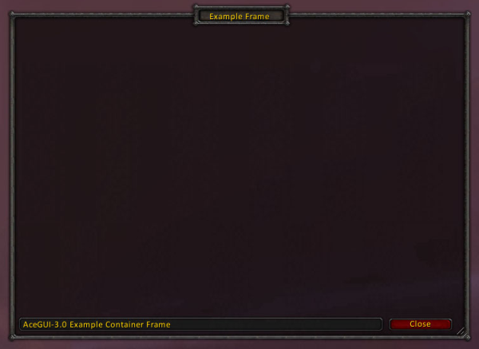
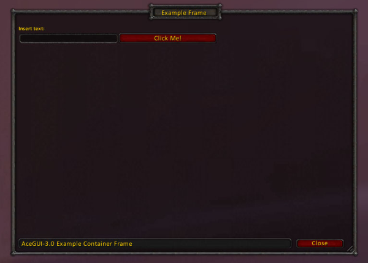

# AceGUI-3.0 Tutorial

AceGUI-3.0 is a library designed to simplify UI creation. This tutorial will focus on the basics in creating a very simple UI, explaining how the different Layouts work, and showing most of the widgets in action.

In all examples and code snippets in this tutorial, we'll assume that you have a local AceGUI variable containing the reference to an AceGUI-3.0 instance, as returned by LibStub.

## A Container Frame

Every UI starts with a container. You can use your own container frames to place the controls in, but for this tutorial we will start with a simple AceGUI Frame container widget.

Lets create an empty Container Frame, and fill some of its attributes.

```lua
local frame = AceGUI:Create("Frame")
frame:SetTitle("Example Frame")
frame:SetStatusText("AceGUI-3.0 Example Container Frame")
```

You'll see the frame on screen, and it should look something like this:



Every Frame widget comes with a Heading, a StatusBar and a Close button, as well as some artwork to make it look like a proper frame.
This frame can be freely resized by the user using the drag-handle in the bottom-right corner, or by dragging the bottom or right border.

Of course, your code can set a size and position for the frame as well, using the default SetWidth, SetHeight and SetPoint frame functions.

If you want to learn more about the APIs of the Frame Widget or Containers in general, check the [AceGUI-3.0 Widgets](AceGUI-3.0%20Widgets.md) - Containers

## Placing Widgets on the Frame

We'll be creating a simple button and an editbox on our frame. This is as simple as asking AceGUI to create them, and adding them as child frames to the container.

```lua
local frame = AceGUI:Create("Frame")
frame:SetTitle("Example Frame")
frame:SetStatusText("AceGUI-3.0 Example Container Frame")
frame:SetCallback("OnClose", function(widget) AceGUI:Release(widget) end)
frame:SetLayout("Flow")

local editbox = AceGUI:Create("EditBox")
editbox:SetLabel("Insert text:")
editbox:SetWidth(200)
frame:AddChild(editbox)

local button = AceGUI:Create("Button")
button:SetText("Click Me!")
button:SetWidth(200)
frame:AddChild(button)
```

When creating widgets, you always need to set a width for them, or they might inherit the width of their previous use in the UI, and your UI might look inconsistent. Don't rely on the default values.

You'll notice that the creation of the Frame container has changed slightly as well. Every container requires you to set a Layout to use.
AceGUI-3.0 currently supports 3 layouts, "List", "Fill" and "Flow".

- The **"Flow"** Layout will let widgets fill one row, and then flow into the next row if there isn't enough space left. Its most of the time the best Layout to use.
- The **"List"** Layout will simply stack all widgets on top of each other on the left side of the container.
- The **"Fill"** Layout will use the first widget in the list, and fill the whole container with it. Its only useful for containers within containers. (We'll see this later.)

Additionally, we've set a "OnClose" Callback on our Frame widget, which will release the container once its closed. Releasing AceGUI frames will return them to the widget pool and allow them to be used by other addons, without creating new frames - reducing overall memory used.
Releasing a container widget will always release its child frames as well, so we do not have to release them seperately here.

You should always release your frames once your UI doesn't need them anymore (i.e. in dynamic lists), or the memory consumption of your addon will increase alot.

When everything works, it should look like this:



More details on the APIs of the Widgets and the available Callbacks can be found on the [AceGUI-3.0 Widgets](AceGUI-3.0%20Widgets.md) page.

## Adding functionality

We do have a nice frame, with a input box and a button. But its really not doing alot, yet.

Lets start with a simple task. Clicking the button should simply print the contents of the editbox.

```lua
local textStore

local frame = AceGUI:Create("Frame")
frame:SetTitle("Example Frame")
frame:SetStatusText("AceGUI-3.0 Example Container Frame")
frame:SetCallback("OnClose", function(widget) AceGUI:Release(widget) end)
frame:SetLayout("Flow")

local editbox = AceGUI:Create("EditBox")
editbox:SetLabel("Insert text:")
editbox:SetWidth(200)
editbox:SetCallback("OnEnterPressed", function(widget, event, text) textStore = text end)
frame:AddChild(editbox)

local button = AceGUI:Create("Button")
button:SetText("Click Me!")
button:SetWidth(200)
button:SetCallback("OnClick", function() print(textStore) end)
frame:AddChild(button)
```

AceGUI widgets usually do not have a "get" function to get their contents, they fire a Callback that notifies the addon of any changes to their data.
`OnEnterPressed` is the Callback of an EditBox that notifies us of any change to the text, and we just save that text in our `textStore` variable.

In the `OnClick` Callback of the Button we simply print this variable.
Of course your addon would do something more useful then just printing the data.

All callbacks in AceGUI-3.0 will always have the widget that issued the callback as the first parameter, and the name of the callback as the second. Any data provided by the widget follows after that.

As you can see, adding functionality to the widgets is very easy. You can read about all Callbacks and their use on the [AceGUI-3.0 Widgets](AceGUI-3.0%20Widgets.md) page.

## Adding a Group Control

The ability to have different groups of controls on a frame is something probably any half-complex UI will need at some point. We'll be demonstrating the use with a Tab Group.

The concept is pretty easy.

- Set the Frame to the Fill Layout
- Create a TabGroup widget, and add it as the only child of the frame.
- Use `:SetTabs` to define which tabs should be displayed.
- Select the initial tab with `:SelectTab`

To know when our addon has to redraw the content, we get the `OnGroupSelected` callback. We'll release all old child frames, and draw the new widgets on the container passed by the event.

Here is a simple example showing the above logic:

```lua
-- function that draws the widgets for the first tab
local function DrawGroup1(container)
  local desc = AceGUI:Create("Label")
  desc:SetText("This is Tab 1")
  desc:SetFullWidth(true)
  container:AddChild(desc)
  
  local button = AceGUI:Create("Button")
  button:SetText("Tab 1 Button")
  button:SetWidth(200)
  container:AddChild(button)
end

-- function that draws the widgets for the second tab
local function DrawGroup2(container)
  local desc = AceGUI:Create("Label")
  desc:SetText("This is Tab 2")
  desc:SetFullWidth(true)
  container:AddChild(desc)
  
  local button = AceGUI:Create("Button")
  button:SetText("Tab 2 Button")
  button:SetWidth(200)
  container:AddChild(button)
end

-- Callback function for OnGroupSelected
local function SelectGroup(container, event, group)
   container:ReleaseChildren()
   if group == "tab1" then
      DrawGroup1(container)
   elseif group == "tab2" then
      DrawGroup2(container)
   end
end

-- Create the frame container
local frame = AceGUI:Create("Frame")
frame:SetTitle("Example Frame")
frame:SetStatusText("AceGUI-3.0 Example Container Frame")
frame:SetCallback("OnClose", function(widget) AceGUI:Release(widget) end)
-- Fill Layout - the TabGroup widget will fill the whole frame
frame:SetLayout("Fill")

-- Create the TabGroup
local tab =  AceGUI:Create("TabGroup")
tab:SetLayout("Flow")
-- Setup which tabs to show
tab:SetTabs({{text="Tab 1", value="tab1"}, {text="Tab 2", value="tab2"}})
-- Register callback
tab:SetCallback("OnGroupSelected", SelectGroup)
-- Set initial Tab (this will fire the OnGroupSelected callback)
tab:SelectTab("tab1")

-- add to the frame container
frame:AddChild(tab)
```