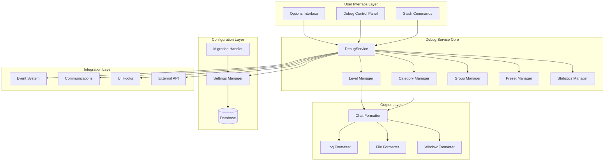
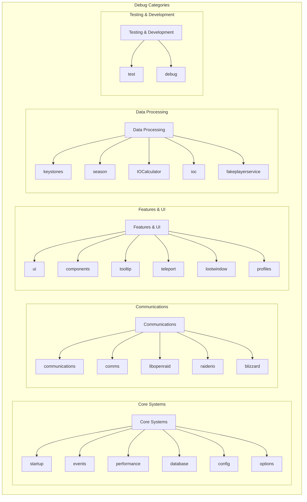
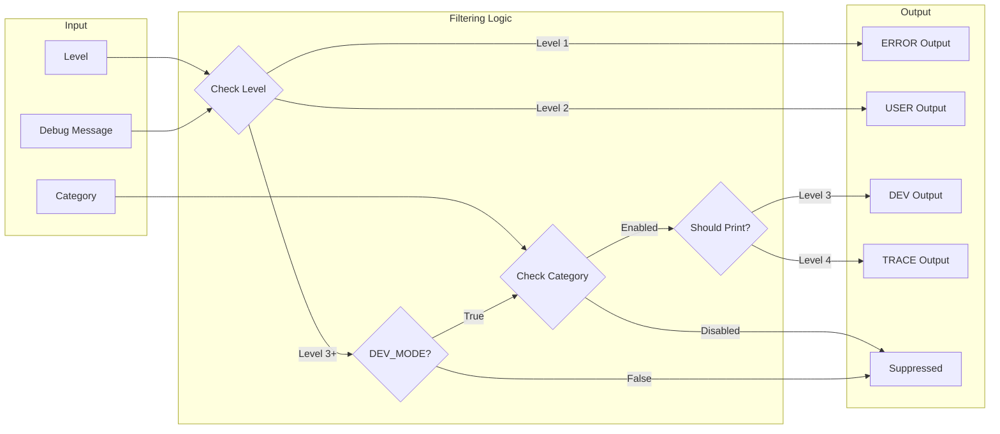
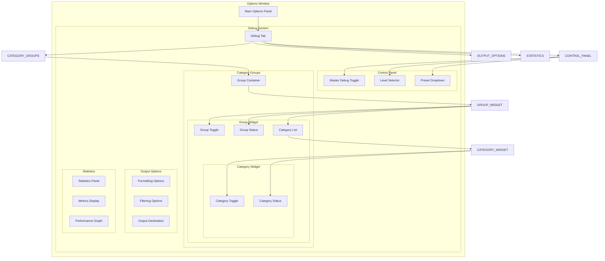
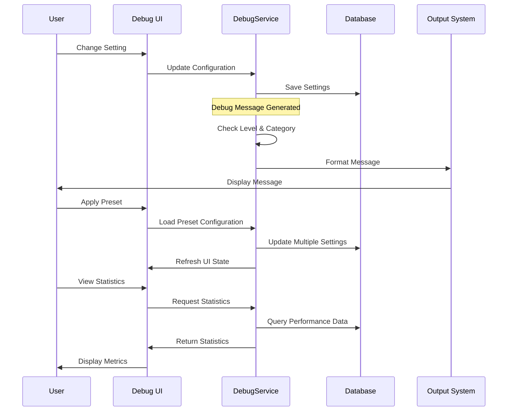
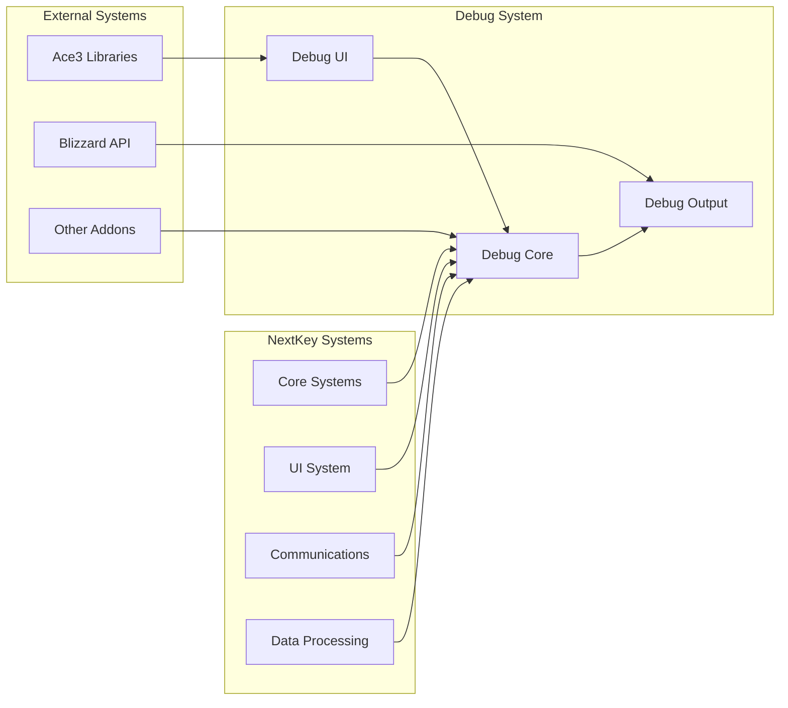
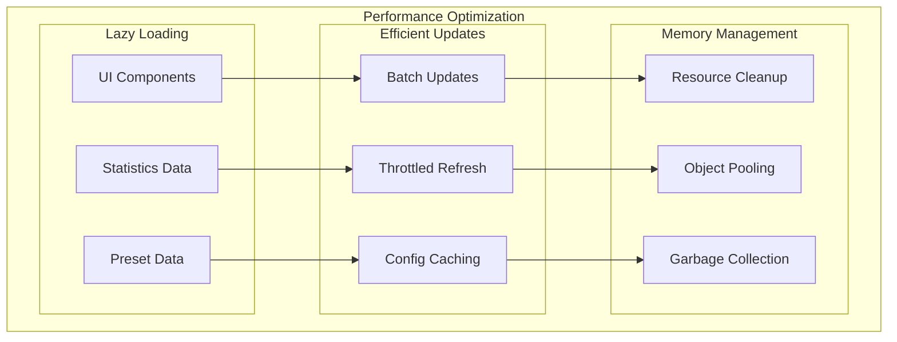
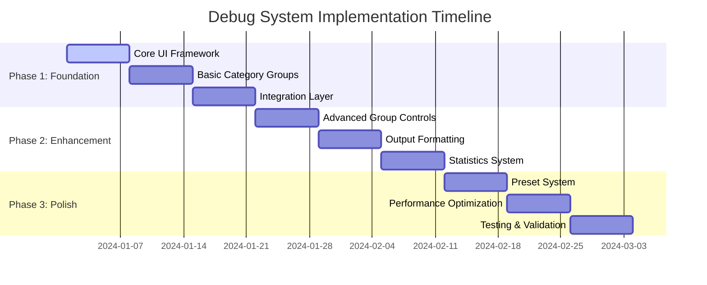

# NextKey Debug System Architecture

## System Architecture Overview

## Category Group Hierarchy

## Debug Level Flow

## UI Component Architecture

## Data Flow Architecture

## Integration Points

## Performance Considerations

## Migration Path

## Key Design Principles

1. **Modularity**: Each component is independent and can be developed/tested separately
2. **Backward Compatibility**: All existing debug calls continue to work unchanged
3. **Performance**: Minimal overhead when debug is disabled, efficient when enabled
4. **Extensibility**: Easy to add new categories, groups, and output formats
5. **User Experience**: Intuitive interface with immediate visual feedback
6. **Maintainability**: Clean separation of concerns and well-documented code

## Technology Stack

- **UI Framework**: AceGUI-3.0 for consistent widget rendering
- **Configuration**: AceConfig-3.0 for options management
- **Data Storage**: SavedVariables with automatic migration
- **Event System**: AceEvent-3.0 for component communication
- **Formatting**: Custom formatters for different output types
- **Performance**: Built-in throttling and caching mechanisms

This architecture provides a solid foundation for the enhanced debug system while maintaining compatibility with existing code and providing a clear path for future enhancements.